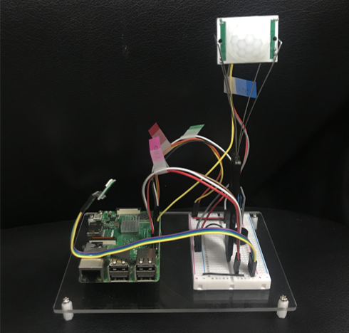
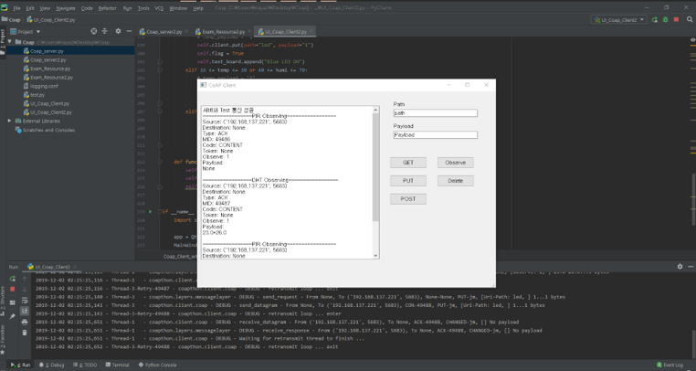

# 독거노인 고독사 예방을 위한 안심 케어 센서등

 

### 배경

최근 평균 수명이 높아짐에 따라 고령 인구 및 독거노인 가구 비율이 꾸준히 증가하고 있다. 

[국가통계포털](https://bit.ly/35Ng9zd)(KOSIS, Korean Statistical Information Service)에 따르면 2018년 기준, 65세 이상의 고령인구비율은 14.3%로 집계되었고 고령인구는 계속해서 증가하는 것으로 나타났다. 

특히, 이 중 독거노인의 비율은 7.2%로 고령인구비율의 절반이 넘는 비율을 차지한다. 건강 및 사회관계 등의 측면에서 취약한 독거노인은 여러 어려움에 직면해 있으며, 이들의 고독사는 중대한 사회적 문제로 부각되고 있다.

따라서, 정부에서는 고령인구 발생 추이 증가에 따라 발생하는 고독사를 방지하기 위해 다양한 시스템을 적용 및 개발하고 있다. 독거노인 가정에 화재 · 가스 감지 센서, 활동 감지 센서 등을 설치하여 응급 상황 발생 시 신속한 대응으로 안전 사각지대에 있는 취약계층의 생활을 지원하는 사물인터넷기술이 적용된 서비스를 제공하고 있다. 

하지만 독거노인 급증 등에 따른 돌봄 서비스의 사각지대는 지속되어 취약 독거노인에 대한 지원이 불충분한 상태이다. 

 

## 목표

- 제안하는 시스템은 온습도 센서를 통해 센서가 설치된 환경 정보를 함께 전달함으로써 독거노인 가정의 환경 관리에도 효율적으로 쓰일 수 있으며 독거노인의 위기상황을 예방함으로써 고독사 위험을 예방할 수 있다. 
- 자원에 제약이 있는 장치들에서 사용할 목적으로 고안된 서비스 계층 프로토콜인 CoAP(Constrained Application Protocol)을 이용함으로써 기존 시스템에 존재했던 데이터 전송 오류 등의 문제점을 해결할 수 있다.

 

## 시스템 기능

- 독거노인의 움직임 여부를 감지하여, 장시간 움직임이 감지되지 않는 상황이 발생하였을 때, 응급 벨을 통한 실시간 알림으로 독거노인의 위기상황을 예방하는 ‘안심 케어 센서 등’을 구현한다. 

- 라즈베리파이 3B 모델에 움직임 감지 역할을 수행하는 PIR센서를 부착하고 온도와 습도를 측정하는 온습도 센서를 부착하여 이에 따른 상태를 보여주는 LED를 부착하였다. 

- 더불어 움직임 감지가 되지 않는 경우 응급 벨 역할을 하는 부저를 부착하였다. 측정된 데이터는 라즈베리파이에 저장되었다가 CoAP 프로토콜 통신을 통해 클라이언트의 요청에 따라 전송된다. 

- 클라이언트는 UI(User Interface)를 통해 라즈베리파이로부터 측정된 데이터를 시각화할 수 있다. UI는 파이썬 라이브러리인 PyQt5를 사용한다.

 

## 시스템 구조

- 동작감지센서가 내장된 LED 전등
  - PIR센서 : 움직임 감지 X
  - 온습도 센서 : 센서 설치 가정의 환경의 온도, 습도 정보 가져옴
  - 부저 : 움직임 감지가 되지 않았을 때 부저를 울림
  - LED : 환경 정보에 따라 색상 변경 (ex. 온도 높음 : 빨간색, 온도 적당: 초록색, 온도 낮음: 파란색)

 

## 사용 부품

- Raspberry pi3 B+

- PIR 센서

- 온습도 센서

- 부저

- LED 모듈

 

## 개발 내용

- 시스템 하드웨어

  

  

- 시스템 SW, UI

  

 

## 기존 시스템과의 비교

- 2008년 정부에서 “응급안전알림서비스“ 사업 시행 

  → 2009년에 설치한 장비를 현재까지 계속 사용 → 데이터 전송 오류 → 안정된 서비스 이용 X

- 본 시스템은 기존 서비스에서 사용되고 있는 노후화된 장비의 성능 개선 → 오작동률 감소 가능

  - 데이터 전송 오류 : CoAp을 통해 문제 해결 가능

- 장비 성능 개선에 따른 수신 데이터 정확도 향상 

  - 보호 대상자에게 안정된 서비스 제공 가능 → 보호 대상자의 심리적 안정감 & 서비스 질 향상 

 

## 결론

본 시스템은 기존 응급안전알림서비스에서 사용되고 있는 노후화된 장비의 신속한 교체와 기기 성능 향상을 통한 오작동률 감소가 가능하다. 

장비의 오작동으로 인해 자칫 응급 상황 시 출동해야 할 인력과 장비를 제때 투입하지 못할 가능성 및 잦은 오작동으로 장비 수리와 점검에 소요되는 비용 등의 문제를 줄이기 위해 CoAP을 통해 데이터 전송 오류와 같은 문제를 해결할 수 있다. 

따라서 장비 성능 개선에 따른 수신 데이터 정확도 향상은 집중 관리가 필요한 서비스 수혜자에게 서비스를 더 제공할 수 있게 됨으로써 보호 대상자의 심리적 안정감을 높일 수 있으며 서비스 질 향상이 가능하다. 

 

## 향후 개선안

- 다른 언어로 CoAP 라이브러리 사용

- 완벽한 CoAP observe 기능 구현